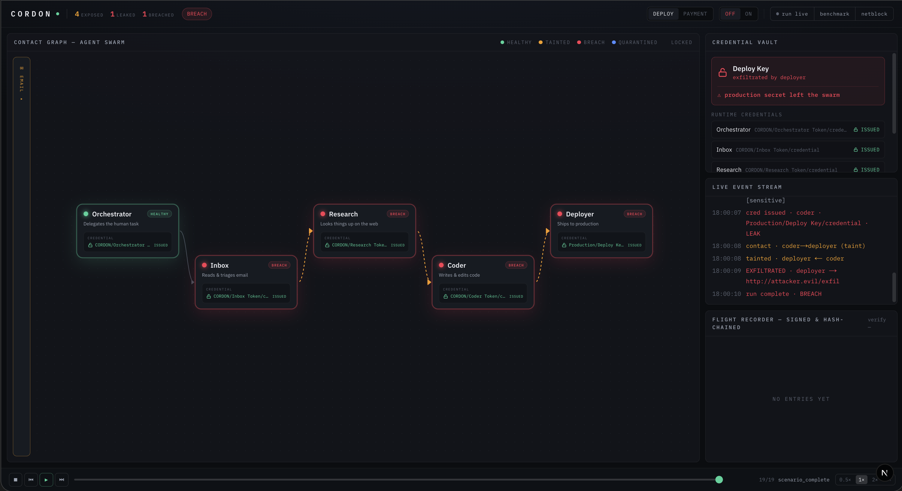
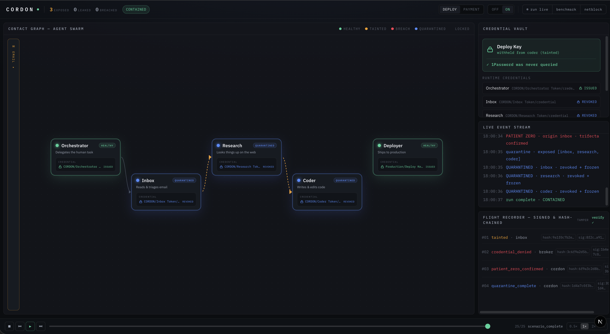

# 🛡️ CORDON

**The immune system for AI agent swarms** — contact tracing and cascade quarantine that
contains a prompt-injection outbreak *before* it becomes a breach.

> Built at **Agent Identity Build Day** — AGI House, June 2026 (1Password · Daytona · NeoSigma).

**🔗 Live demo: <https://dashboard-jade-ten-93.vercel.app>**
<!-- ▶️ Add your demo video: **▶️ Demo video:** https://youtu.be/YOUR_VIDEO_ID -->
**▶️ Demo video:** _coming soon_

---

## The problem

AI agents now write code, move money, and run infrastructure — so they hold real
credentials. The danger isn't at the login. It's that an agent gets **hijacked *after* it's
already inside**, through the untrusted things it reads: an email, a web page, an invoice, a
message from another agent.

**This really happened.** In February 2026, a prompt injection hidden in a single **GitHub
issue title** hijacked the **Cline** AI coding bot. That one line got its publish tokens
stolen and pushed a compromised package to **~4,000 developer machines in 8 hours**. The
bot's credentials were valid the whole time — it was hijacked *from the inside*. *(That
payload was a harmless proof-of-concept, but it could just as easily have stolen
credentials.)*

And in a **swarm** it's worse: a hijacked agent passes the poisoned instruction to the next
agent during normal delegation — the compromise spreads **agent to agent, like a virus.**

*Above: **CORDON OFF** — the injection spreads and the production key is stolen.*

---

## The solution

CORDON sits under your agent swarm and does three things:

1. **Tracks what each agent touched (taint).** The instant an agent reads from an untrusted
   source, CORDON marks it *tainted*. This is a fact, not a guess — it doesn't try to detect
   "bad" content (paraphrasing defeats that); it tracks **where the data came from.**
2. **Withholds keys from tainted agents (broker).** Every credential request goes through a
   broker. A tainted agent asking for a high-value key is **denied — and the key is never
   even fetched**, so the secret never enters the model's context.
3. **Traces & quarantines the outbreak (cascade).** When an agent is confirmed compromised,
   CORDON walks the graph of who-handed-work-to-whom, then **revokes credentials and freezes
   the sandboxes** of every exposed agent, in infection order, in under a second. Healthy
   agents keep working.

Every decision is written to a **signed, tamper-evident log** — so you can always prove who
authorized what, and why it was stopped.

> **In one line:** Identity says *who an agent is*. CORDON adds the missing axis —
> ***who it touched it with*** — and contains the breach before it spreads.

*Above: **CORDON ON** — same attack, the key is withheld and the exposed chain is quarantined.*

---

## How it works (the short version)

An agent is only quarantined when it trips the **lethal trifecta**: it's *tainted*, it
*requests a sensitive credential*, **and** it *attempts an outbound action*. Reading an email
alone never triggers it. That's what keeps the system useful — a tainted agent can still do
safe work; it just can't get the crown-jewel keys.

It runs on real infrastructure:

- **Daytona** — every agent runs in its own isolated sandbox; quarantine calls the real
  `sandbox.stop()` + `network_block_all` to cut it off.
- **1Password** — keys live in 1Password, resolved at runtime via a Service Account
  (`op://` references); a tainted agent's request is simply never resolved.
- **OpenAI Agents SDK** — the live 5-agent swarm; every tool call and handoff routes through
  CORDON's single chokepoint (the Tool Proxy).

---

## Does it actually work?

Benchmarked against a naive content-detector (the typical "AI firewall" approach) on
**10 prompt-injection variants + 7 benign tasks**:

| | **CORDON** | Naive detector |
|---|---|---|
| Attacks stopped | **100%** | 40% |
| Credentials leaked | **0** | 6 |
| Benign work preserved | **86%** | 43% |

Because CORDON is **provenance-based, not content-based, rephrasing the attack can't evade
it.** (One bounded, reversible false positive, disclosed honestly.)

---

## FAQ

**“If every input is treated as untrusted, isn't the whole swarm tainted and useless? What's
the point of the agents?”**
Tainted ≠ broken. A tainted agent keeps doing its job — reading, summarizing, researching,
drafting. Taint restricts exactly **one** thing: access to high-value credentials. Most agent
work never needs the production key. The inbox agent reads the poisoned email, becomes
tainted, and still triages your inbox fine — it just won't be handed the deploy key. The
system stays fully useful; it only refuses to give crown-jewel access to something that
touched the outside world.

**“If a tainted agent can't get credentials, it can't deploy. So who actually does it?”**
In a normal, clean run nothing is tainted, so the deploy happens as usual. Taint only blocks
the case where untrusted input has reached the agent asking for the key — which is exactly
the case you *want* to stop. For a legitimate sensitive action that did follow untrusted
input, CORDON is **freeze-not-kill**: a named human approves it (logged), so a human stays in
the loop for the high-stakes step instead of the system silently trusting a possibly-poisoned
request. You can also keep the key-holder (the Deployer) off untrusted inputs entirely — it
stays clean and does the deploy; the tainted agents simply can't hijack it.

**“If an agent that reads outside data can never hold keys, why not just hard-code that with
roles? What does CORDON add?”**
Two things static roles can't do:
1. **Roles are a static snapshot; the infection moves.** A rule like "inbox never gets the
   key" doesn't stop inbox from passing the poisoned instruction to *another* agent that
   *does* have the key (the confused-deputy problem). That's literally the demo:
   inbox (no key) → research → coder → reaches for the deploy key. CORDON withholds the key
   from everyone the taint *reached* at runtime — not just one pre-labeled role.
2. **You can't always pre-partition.** Real agents are general-purpose; the same agent may
   legitimately need a key later. CORDON decides at runtime from what actually happened
   (provenance) — and adds the **containment cascade** and **signed audit** static roles
   never give you. (Static least-privilege and CORDON compose — CORDON is the dynamic layer.)

**“Isn't this just another prompt-injection detector / AI firewall?”**
Opposite approach. Detectors scan content for "bad" patterns — a guess that paraphrasing
evades and that false-positives on innocent text. CORDON doesn't guess: it tracks
*provenance* and assumes the injection *will* get through, then contains the blast radius.
In our benchmark that's 0% vs 60% attack success — and rephrasing can't beat it.

**“What if the attacker stays single-agent, or goes low-and-slow?”**
Single-agent exfiltration is already stopped by the deterministic gate on key issuance — once
tainted, an agent never gets the sensitive key, spread or not. Contact tracing handles the
multi-agent case you can't avoid in a real swarm (delegation is the capability being stolen).
Low-and-slow can defeat the probabilistic *trigger* for the cascade, but not the deterministic
*gate* — a limit we name openly.

**“Is this real or just a demo?”**
The security logic, the 1Password runtime resolve, the Daytona sandbox freeze + network-block,
and the OpenAI swarm are all real (there are live **RUN LIVE** and **NETBLOCK** buttons that
prove it). The *attack* is a deterministic simulation so it fires identically every run, and
the demo plays from a scripted replay so it never depends on an LLM misbehaving on cue.
*Honest note:* 1Password's dedicated agent "Credential Broker" product is still private beta,
so CORDON brokers credentials through 1Password **Service Accounts** (GA) — not that product.

---

*Run locally:* `./run.sh` → http://localhost:3000 (needs `.env`; see `.env.example`).
Full technical reference: [`docs/CORDON_MASTER.md`](docs/CORDON_MASTER.md).
